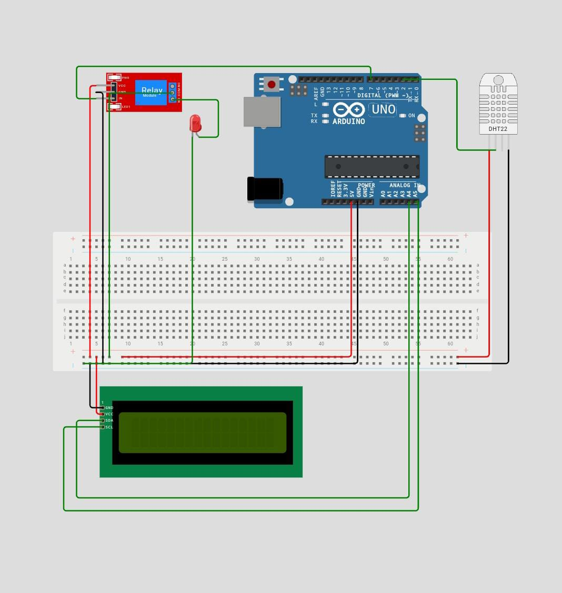

# DHT22 Relay LCD – IoT Temperature and Humidity Monitoring System

This project is part of the **Komputer dan Masyarakat** course assignment, aimed at implementing **Internet of Things (IoT)** technology to solve real-world problems. The system utilizes a temperature and humidity sensor (DHT22), an LCD display, and a relay module for automated environmental control.

## Project Description

This IoT-based monitoring system is designed to:
- Measure **temperature and humidity** in real time using a DHT22 sensor
- Display the readings on an **I2C LCD screen**
- Automatically **control a relay module** based on environmental conditions

The system can be applied in various settings such as storage rooms, production environments, or home-based small businesses (e.g., furniture manufacturing), where controlling air quality is essential to maintain material integrity and working comfort.

## Social Background

In many community-based environments, such as small and medium enterprises (SMEs), workspace humidity and temperature can directly affect product quality and human comfort. For example, excessive moisture can damage wood materials in furniture production. This project demonstrates how simple, low-cost IoT tools can empower local communities to build practical, sustainable solutions for environmental monitoring and control.

## Components Used

- Arduino Uno
- DHT22 Temperature and Humidity Sensor
- 20x4 I2C LCD Display
- Relay Module
- LED Indicator
- Breadboard and jumper wires

## Wiring Diagram



## Features and Logic

The main program is written in Arduino C++ and is available in the file `main.ino`. Key features include:
- Real-time temperature and humidity readings
- Display of sensor data on the LCD screen
- Conditional control of a relay module based on sensor thresholds

### Relay Logic

```cpp
if (temperature < 28 || humidity < 50) {
  digitalWrite(RELAY_PIN, LOW); // Turn ON the relay
} else {
  digitalWrite(RELAY_PIN, HIGH); // Turn OFF the relay
}
